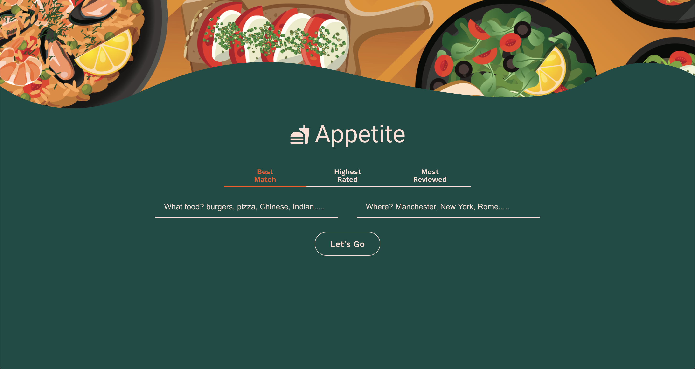

</img>

## Appetite 🍕

Appetite is a React web app, that was built to use the Yelp API in order to display Yelp's establishment content based on a users search. A user can input a type of cusine keyword and a location keyword and all restaurant establishments will be shown with details of the establishment.

### Technologies Used 💻
- HTML
- CSS
- Javascript
- React
- Yelp API

🌐 <a href="">Checkout Appetite on my portfolio</a>